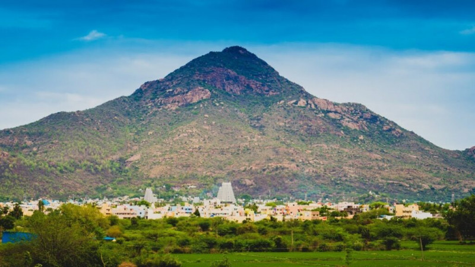

# Ex04 Places Around Me
## Date: 

## AIM
To develop a website to display details about the places around my house.

## DESIGN STEPS

### STEP 1
Create a Django admin interface.

### STEP 2
Download your city map from Google.

### STEP 3
Using ```<map>``` tag name the map.

### STEP 4
Create clickable regions in the image using ```<area>``` tag.

### STEP 5
Write HTML programs for all the regions identified.

### STEP 6
Execute the programs and publish them.

## CODE
'''
home.html
<!DOCTYPE html>
<html lang="en">
<head>
    <meta charset="UTF-8">
    <meta name="viewport" content="width=device-width, initial-scale=1.0">
    <title>Document</title>
</head>
<body>
 <!-- Image Map Generated by http://www.image-map.net/ -->
<!--  -->

<map name="image-map">
    <area target="" alt="Annamalaiyar hills" title="Annamalaiyar hills" href="hill.html" coords="458,375,135" shape="circle">
    <area target="" alt="Annamalaiyar Temple" title="Annamalaiyar Temple" href="temple.html" coords="723,606,591,433" shape="rect">
</map>
</body>
</html>
hill.html
<!DOCTYPE html>
<html lang="en">
<head>
    <meta charset="UTF-8">
    <meta name="viewport" content="width=device-width, initial-scale=1.0">
    <title>Document</title>
</head>
<body>
    <!--  -->
    <p>The Annamalaiyar Hills, also known as the sacred Arunachala Hill, rise majestically over the ancient town of Tiruvannamalai, creating a landscape where spirituality and nature blend seamlessly. Revered as the embodiment of Lord Shiva in the form of fire, the hill has drawn saints, seekers, and pilgrims for centuries. Its rocky slopes glow under the sun, giving it an aura that feels both timeless and powerful. At the foothills stands the grand Annamalaiyar Temple, one of South India’s most iconic Shiva temples, anchoring the spiritual energy of the region. Devotees from across the world come to perform Girivalam, the 14‑kilometer circumambulation around the hill, especially during full moon nights when the atmosphere becomes electric with devotion. The annual Karthigai Deepam festival transforms the hill into a beacon of divine light as a massive flame is lit at its peak. The hill is also home to serene meditation spots like Skandashramam and Virupaksha Cave, where Sri Ramana Maharshi spent years in deep contemplation. The paths leading up the hill offer breathtaking views of the town and the surrounding plains. Early mornings bring a soft mist that wraps the hill in a mystical veil, while evenings paint it in warm golden hues. Many believe that simply being near Arunachala brings peace, clarity, and inner transformation. Its ancient rocks, said to be among the oldest geological formations on Earth, hold stories of sages and seekers who found enlightenment in its presence. Whether one visits for devotion, meditation, or the sheer beauty of nature, the Annamalaiyar Hills leave an imprint that lingers long after the journey ends.</p>
</body>
</html>
temple.html
<!DOCTYPE html>
<html lang="en">
<head>
    <meta charset="UTF-8">
    <meta name="viewport" content="width=device-width, initial-scale=1.0">
    <title>Document</title>
</head>
<body>
     <!--  -->
    <p>The Annamalaiyar Temple of Tiruvannamalai stands as one of the grandest and most revered Shiva temples in India, radiating centuries of devotion, architecture, and cultural heritage. Spread across a vast 10‑hectare complex, the temple rises with four towering gopurams, the tallest reaching an impressive height that dominates the skyline of the town. Dedicated to Lord Shiva as Annamalaiyar and Goddess Unnamulai Amman, the temple symbolizes the element of fire, one of the sacred Pancha Bhootas. Its stone corridors echo with ancient chants, while intricately carved pillars narrate stories of dynasties that nurtured this spiritual marvel. The temple’s origins trace back to the Chola period, with later contributions from the Vijayanagara kings, each adding layers of beauty and grandeur. Pilgrims flock here throughout the year, but the energy peaks during Pournami and the Karthigai Deepam festival, when millions gather to witness the lighting of the massive flame atop Arunachala Hill. The temple tank, Brahma Teertham, adds a serene charm to the complex, reflecting the gopurams in its still waters. Walking through the temple feels like stepping into a living museum of Tamil culture, where rituals, music, and architecture blend seamlessly. The sanctum radiates a powerful spiritual presence that devotees describe as transformative and deeply calming. Every corner of the temple carries the weight of history, devotion, and divine symbolism. Whether one visits for worship, architecture, or the sheer spiritual atmosphere, the Annamalaiyar Temple leaves an unforgettable impression that lingers long after the visit ends.</p>
</body>
</html>
'''

## OUTPUT




## RESULT
The program for implementing image maps using HTML is executed successfully.
